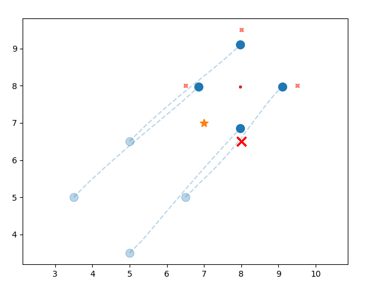
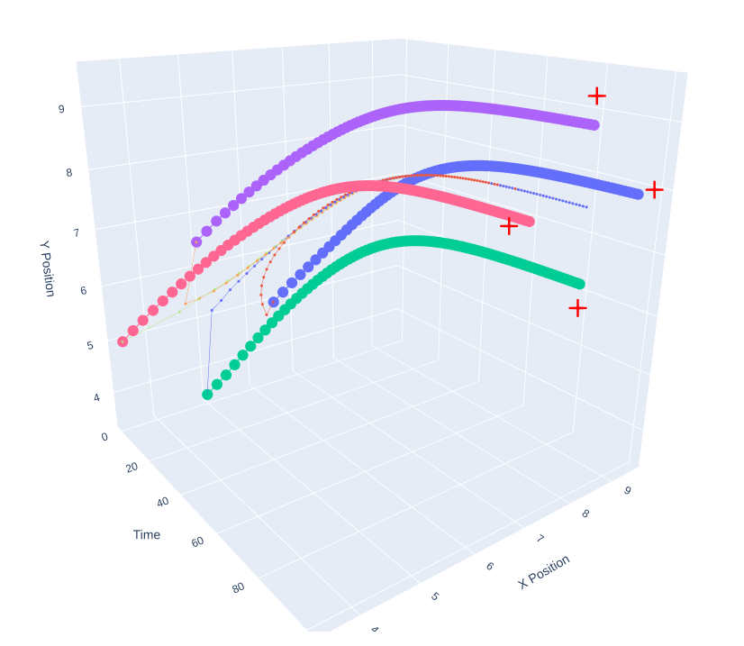
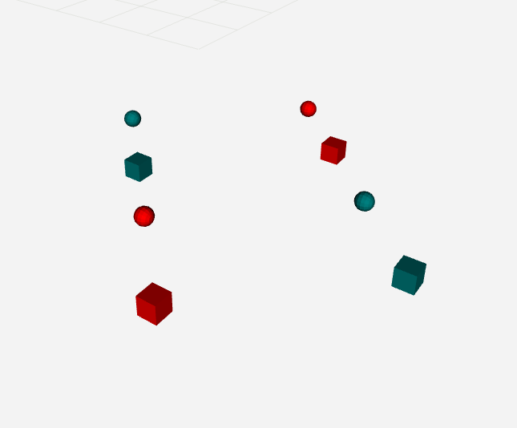
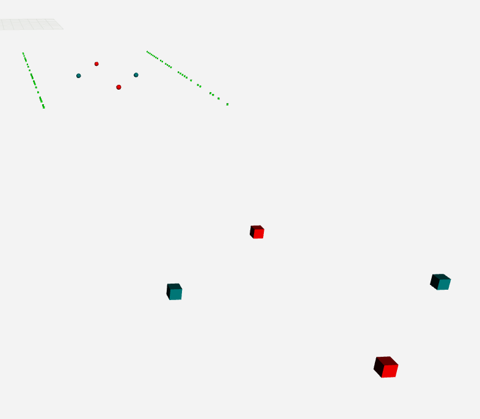
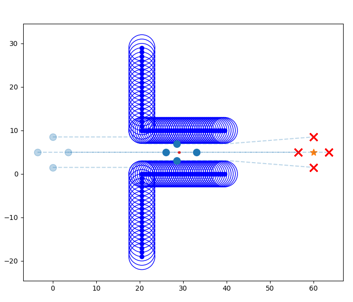
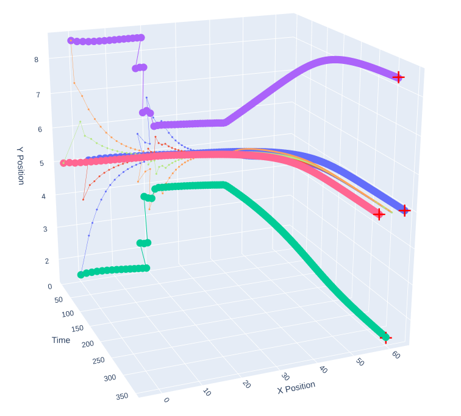

# Aggregative Optimization for Multi-Robot Systems

[](https://www.python.org/)  
Distributed multi-robot coordination using Aggregative Tracking, Potential Functions, and ROS 2-based optimization in real time.

---
## 📌 Project Info
- 🎓 Course: Distributed Autonomous Systems
- 🏫 University of Bologna
- 📅 Year: 2025
---

## 🧠 About the Project

This project explores decentralized control and optimization strategies for **multi-robot systems** using **Aggregative Tracking**, **Potential Functions**, and a **ROS 2-based distributed implementation**. It represents the second part of the final project for the **Distributed Autonomous Systems** course at the MSc in Automation Engineering, University of Bologna.

The project is structured into three main tasks:

- 🛰 **Task 2.1** – Multi-robot surveillance using Aggregative Tracking (Python)
- 🤖 **Task 2.2** – Real-time distributed implementation in ROS 2
- 🚧 **Task 2.3** – Corridor navigation with Potential Functions and Projected Optimization (Python)

---

## 🗂 Project Structure

```
📦 aggregative-multirobot/
├ 📁 task2_1_ws/                        # ROS 2 workspace for Task 2.1
├ 📁 task2_3_ws/                        # ROS 2 workspace for Task 2.3
├ 📁 images/                            # Plots and 2D/3D animations
│ ├ 📸 task2_1_python.png               # Surveillance – 2D Python
│ ├ 📸 task2_1_3d.png                   # Surveillance – 3D Python
│ ├ 📸 task2_1_rviz.png                 # Surveillance – RVIZ
│ ├ 📸 task2_3_python.png               # Corridor – 2D Python
│ ├ 📸 task2_3_3d.png                   # Corridor – 3D Python
│ └ 📸 task2_3_rviz.png                 # Corridor – RVIZ
├ 💻 Task2_1.py                         # Python simulation - surveillance
├ 💻 Task2_3.py                         # Python simulation - corridor
├ 💻 Projected_Aggregative_Tracking.py  # Projected optimization implementation
├ 💻 Project_Functions.py               # Shared utilities
├ 📘 report_group_03.pdf                # Full project report (pages 19–33)
└ 📄 README.md                          # You are here!
```

---

## ⚙️ How to Run

### 🔹 Task 2.1 – Multi-Robot Surveillance via Aggregative Tracking (Python)

Simulates robots jointly tracking local targets and a global goal, while maintaining a formation using an aggregative optimization strategy.

```bash
$ python3 Task2_1.py
```

🔧 **Adjustable Parameters:**
- `NN`, `MAXITERS`, `step-size`, `radius`, `b`, etc.
- Enable target motion with `moving_loc_targets=True`
- Tune weights: `gamma_r_lt`, `gamma_agg`, `gamma_bar`

📈 **Outputs:**
- Cost and tracking plots  
- 2D and 3D animations  
- Example outputs:

<p align="center">
  
  
  
</p>

---

### 🔹 Task 2.2 – Real-Time ROS 2 Implementation

A distributed setup where each robot runs as a ROS 2 node, communicating through message-passing to collaboratively solve surveillance and navigation problems.

#### ▶ Task 2.2.1 – Surveillance

```bash
$ cd task2_1_ws/
$ colcon build --symlink-install
$ . install/setup.bash
$ ros2 launch task2_ros task2_ros.launch.py
```

Then visualize centralized results:

```bash
$ cd src/task2_ros/centralized_animation/
$ python3 centralized_animation.py
```

#### ▶ Task 2.2.3 – Corridor Navigation

```bash
$ cd task2_3_ws/
$ colcon build --symlink-install
$ . install/setup.bash
$ ros2 launch task2_3 task2_3.launch.py
```

Then visualize:

```bash
$ cd src/task2_3/centralized_animation/
$ python3 centralized_animation.py
```

🖼️ Example ROS 2 visual outputs:

<p align="center">
  
  
</p>

---

### 🔹 Task 2.3 – Corridor Navigation (Python)

Robots navigate through a corridor while avoiding walls and reaching targets.

#### ➤ Option 1: Potential Functions

```bash
$ python3 Task2_3.py
```

- Set corridor layout, wall avoidance (`avoid_walls=True`), layout style, and gain

#### ➤ Option 2: Projected Aggregative Tracking

```bash
$ python3 Projected_Aggregative_Tracking.py
```

- Three-stage projected optimization: to-corridor → through-corridor → to-targets
- Robust to infeasible solutions and wall collisions

📈 **Outputs:**
- Cost, gradient, and animation plots  
- Example outputs:

<p align="center">
  
  
</p>

---

## 📊 Output & Evaluation

- 📈 Cost and gradient convergence
- 📌 Barycenter and target tracking
- 🎯 Formation cohesion & task performance
- 🔁 Comparison of centralized (Python) and distributed (ROS 2) execution

---

## 👨‍🎓 Authors

Group 3 – MSc Automation Engineering, University of Bologna  
- Andrea Perna  
- Gianluca Di Mauro  
- Meisam Tavakoli  

📧 and.perna99@gmail.com

---

## 👩‍🏫 Supervisors

- Prof. Giuseppe Notarstefano  
- Prof. Ivano Notarnicola  
- Dr. Lorenzo Pichierri

---

## 📎 Resources

- [📘 Full Report (PDF)](./report_group_03.pdf) *(see pages 19–33)*  
- 🎞️ Animations and visualizations in `/videos/`

---

## 📜 License

All rights reserved.
